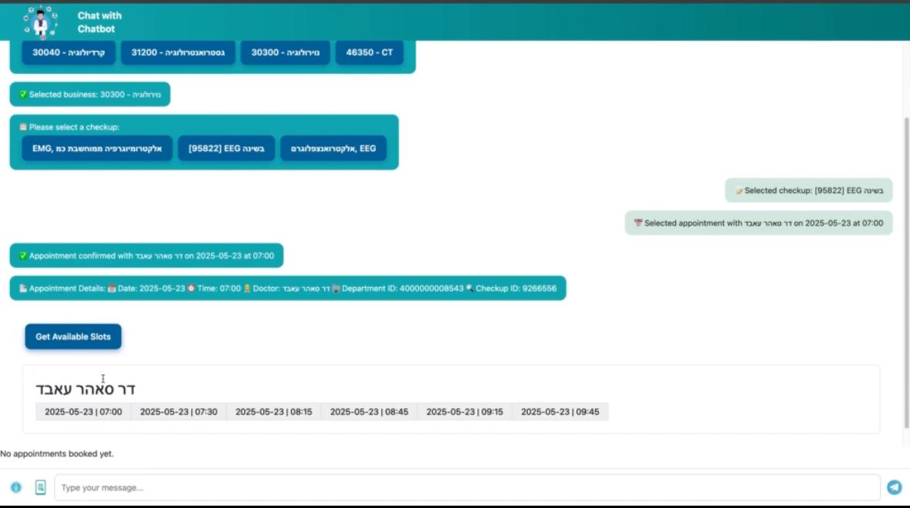

# 🏥 Medical AI Chatbot (Student Project)

This is a simplified version of our chatbot built for educational purposes. It helps simulate how AI could assist patients inside hospitals by answering questions, managing appointments, and sending SMS notifications.

---

## 🔧 Technologies Used

- 🧠 **Gemini AI** – for natural, medical-style conversations  
- 📅 **GBooking API** – to book and retrieve appointment data  
- 💬 **Twilio SMS** – for login verification and appointment notifications  
- 🌐 **Flask** – Python web backend framework  
- 🗄️ **MongoDB** – to store users, chats, and appointment data  
- 🤝 **Team Collaboration** – built with teamwork during a group study project
## 👥 Team Members
- 
- 👨‍💻 Sleman Qtawe – Project Lead, Gemini AI integration, Flask backend  
- 👩‍💻 Mahmoud Jbareen – GBooking API setup, Twilio SMS integration  
- 👨‍💻 Mais Jazmawe – MongoDB database design, backend routing  
- 👩‍💻 Jenan Agbaria – Frontend integration, chatbot UI/UX  
- 👨‍💻 Tamara Mahjna – Deployment, testing, and documentation

---

## 💡 Main Features

- Chatbot that answers questions using Gemini AI  
- Doctor login using SMS verification via Twilio  
- Appointments managed through GBooking API  
- SMS reminders and confirmations  
- All data stored in MongoDB (patients, doctors, chats)
